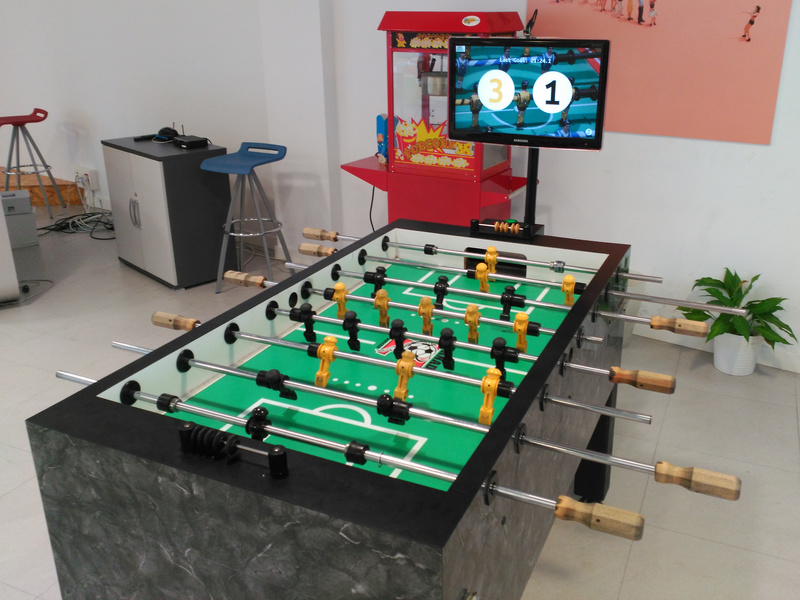

# Foosball slow motion instant replay

Ever wanted to relive your best foosball shots? Now you can with this project!
Featuring:
 * Automatic goal detection & score-keeping
 * Automatic instant replay (2x slow motion) of the last goal
 * Upload replays to Youtube
 * HipChat integration to send Youtube URLs and report game progress
 * Integration with a league system

See a video of it in action:

[](https://www.youtube.com/watch?v=BXMhitiaXEE)



To build it you'll need
 * A foosball table ;)
 * A TV
 * A Raspberry Pi (2 or 3) to run the UI - **Note - the Raspberry Pi4 is not supported**
 * The Raspberry Pi camera module to record video
 * Some electronic components for the goal detection (and maybe an Arduino)

You can find more info on how to build its components in the [doc folder](doc/HWSetup.md)

Take a closer look at the UI and the different game modes in the [ui folder](doc/ui/ui.md)

## Installation

To install it on a RaspberryPi please follow the [installation guide](doc/Installation.md)

## Running on a normal PC

When running in X11 it's often useful to change the window size changing the scaling factor (-s 3 runs at 1/3 of the size)
```
python3 foos.py -s 3
```

If you want to use a keyboard on the Raspberry PI you can enable the io_evdev_keyboard plugin.
This will read directly from the evdev input device (make sure pi user is in the input group and has access to /dev/input/*)
Remember this will only work on physical keyboards attached to the PI - not if you're pressing keys in a ssh session!

Keys in X11 and Raspberry PI:
 * Increment goal counter: `q, KP7, e, KP9`
 * Decrement goal counter: `z, KP1, c, KP3`
 * Ok: `s, KP5`
 * Simulate goal: `a, KP4, d, KP6`
 * Exit: `.`

## Troubleshooting

Please check the [Troubleshooting](doc/Troubleshooting.md) section for some common issues.

## Acknowledgments

Team:
 * Jesús Bravo
 * Daniel Pañeda
 * Stefan Wehner

Big thanks to:
 * [Tuenti](http://www.tuenti.com), where this project started as a HackMeUp
 * Laura Andina for the UI design
 * [Adam Bartha](https://github.com/bartha-adam) for the Pi-only version

Made with Pi3d

[](https://pi3d.github.io/)
