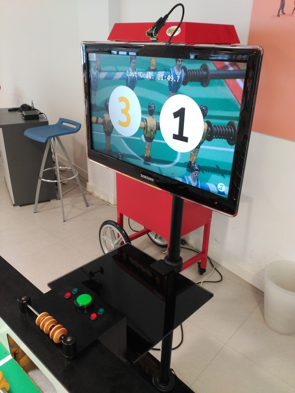
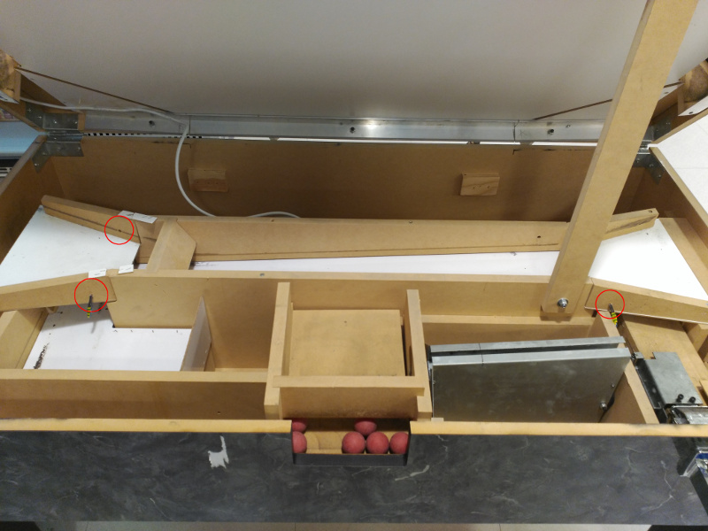
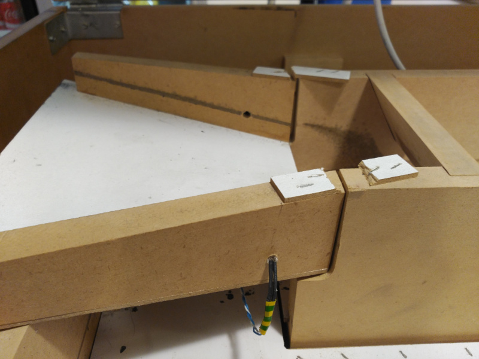
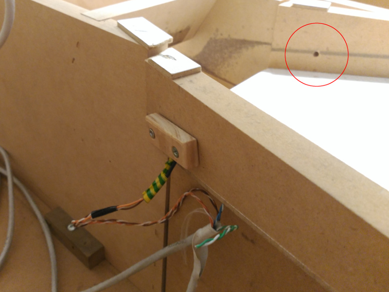
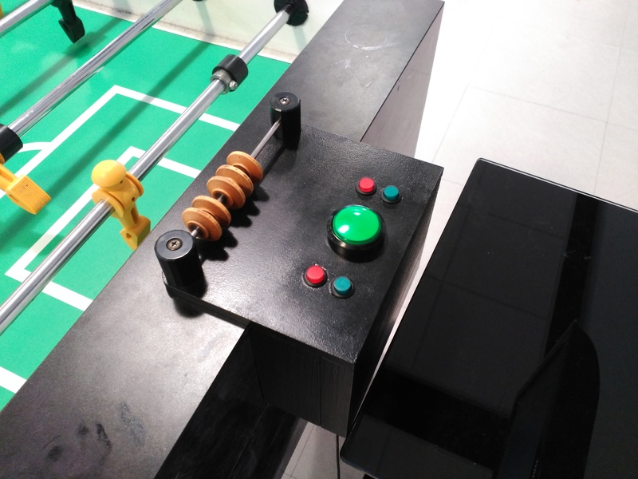
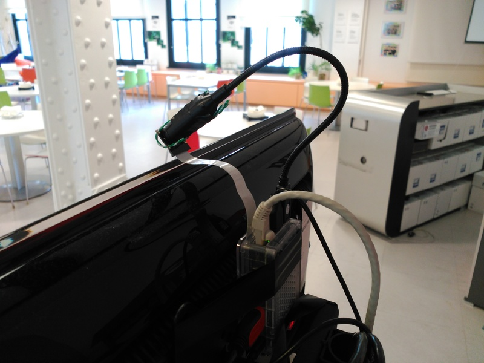
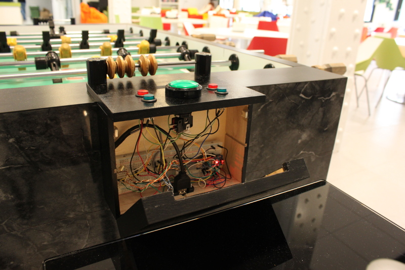

# Hardware Setup

These are the following hardware elements needed for the replay setup:
 * Raspberry Pi
 * Raspberry Pi camera module
 * Optional: Arduino (Nano) w/ push buttons and IR barrier
 * TV





## Goal detection

We've chosen an IR barrier for the goal detection - using a regular IR LED together with the [TSSP58038](http://www.vishay.com/docs/82479/tssp58038.pdf) receiver module.
It is installed under the board, in the ball guide where the balls roll to the pick-up slot. We drilled holes on each side of the ramp and install the emitter on one side and the reciever on the other.
Due to the table's construction it's possible for balls coming in the black goal to run all the way up towards the yellow goal and actually going through the IR barrier. To avoid this there's a minimum time between goals that the GUI checks for.

IR barrier mounted undear each goal



IR emitting LED



IR Receiver mounted to a small piede of wood behind the hole



## User interaction

We've included 5 push buttons so that the players can interact with the UI, to perform the following actions:
 * Increase/Decrease score for each team
 * Reset score
 * Request replay manually
 * Upload last replay to Youtube

We've tried to keep the modifications of the table to a minimum so the button box is fixed to the table using the screws of the yellow score posts.



## Raspberry Pi

The Raspberry Pi runs:
 * GUI with TV output
 * Camera recording for replays
 * Powering Arduino and communicating with it over the serial interface

In our setup the TV is mounted on a TV trolley that is standing right beside the table. The Raspberry Pi is taped to its back with the camera sticking out over the top.
It only needs the power cable and a network cable and a USB cable to the Arduino inside the button box.



## Replay

The video is recorded using raspivid at 49 fps with a fixed number of segments. When a goal occurs the replay of the last few seconds is generated simply concatenating the most recent chunks.
It is then simply replayed on a layer under the UI with a transparent background, so that the current score can be drawn on top.

## Motion detection

The motion detection is done using the motion vectors that raspivid can output to a separate file for each video chunk.
These files are read in and each frame we chck if there are enough motion vectors big enough to consider it movement.
To avoid false positives due to camera vibration we require a number of contiguous frames with movement.
All config related to motion detection depends a lot on the parameters of the camera (resolution, chunk size, etc...) and might not work correctly if the config changes.
You can find more info here: https://www.raspberrypi.org/blog/vectors-from-coarse-motion-estimation/

## Arduino

The arduino takes care of getting input from the push buttons, and detecting when a goal is scored (IR Barrier) and sends these events over the serial interface.
It also reads from the serial interface to turn the LEDs on the push buttons on off.
In our setup the arduino is inside a box with the push buttons, from there we run a multiwired cable (it's actually a cat-5 ethernet cable) inside of the table to run the IR barrier under each of the goals.
It mainly debounces all input from the buttons and the IR barriers and sends easy to read events over the serial interface.
From the bow we needed to run a cable inside of the table for the goal detecting IR barriers - here we just drilled a small hole right behind the goal.



A 38kHz singal is required for the emitter of the IR barrier, so this signal is generated using timer1 on pin D9. We've included a transistor so the LEDs are not directly driven from the Arduino output pin.
The IR receivers are connected to Pin D2 and D3 and interrupts are attached to these pins to detect goals. The pushbuttons are connected to the digital pins following D3, and are read at a fixed interval to debounce the switches.
The button LEDS are connected to the analog pins.

### Arduino Configurations
The project now supports **three** options on **two** different models of Arduinos (Nano and Micro.)  Click to review the full list of [Models and Schematics](../arduino/Readme.md).


## Setup without an Arduino

You can also run the whole setup without an Arduino and use the RaspberryPI to generate the 38Khz signal for the IR Leds, and read the IR receivers/buttons directly from the RPIs GPIO.

You only have to connect everything directly to the RaspberryPi GPIO and enable the io_raspberry plugin (see config.py.sample for config options).
Verify the pin numbers in the config, and you're good to go!

Thanks to Adam Bartha for this!

Click here to view the schematic for the [Raspberry PI](schematics/foos_RPi_only_schema.png).

## BOM

 * [Raspberry Pi2](https://www.raspberrypi.org/products/raspberry-pi-2-model-b/)
 * [RPi camera module](https://www.raspberrypi.org/products/camera-module/)
 * Something to hold up the camera - we ended up using a flexible USB webcam similar to: http://www.goodluckbuy.com/images/detailed_images/sku_65592_2.jpg)
 * [Arduino Nano](https://www.arduino.cc/en/Main/ArduinoBoardNano)
 * 2x IR Led (e.g. Vishay TSHF6410)
 * 2x IR receiver Vishay TSSP58038
 * Push buttons (2x http://www.dx.com/p/non-locking-round-push-button-switches-black-red-2-pcs-366644 and http://www.dx.com/p/diy-push-button-switch-black-green-2-pcs-151988)
 * Breadboard
 * 7x 330 Ohm resistors
 * 1x 10k Ohm resistors
 * 2x 100 Ohm resistors (optional)
 * 2x 100nF Capacitors (optional)
 * NPN transistor (e.g. BC548, 2N2222 or similar)
 * Box for buttons

## Setup Youtube upload

To set up Youtube upload, first you need to create OAuth2 credentials for your account.
Please follow this guide: https://support.google.com/cloud/answer/6158849 and create credentials for application type other.
Download the client_secrets.json file and place it into the foos root folder.

Restart foos.py and upload the lates replay (long-press on 's', central button). Check the console output, it should show something like:

```
Go to the following link in your browser:

    https://accounts.google.com/o/oauth2/auth?...

Enter verification code:
```

Go to that URL on a browser, get and enter the verification code.
