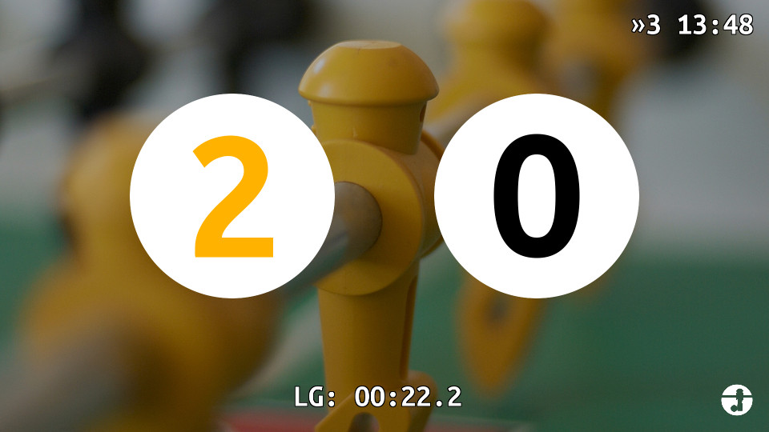
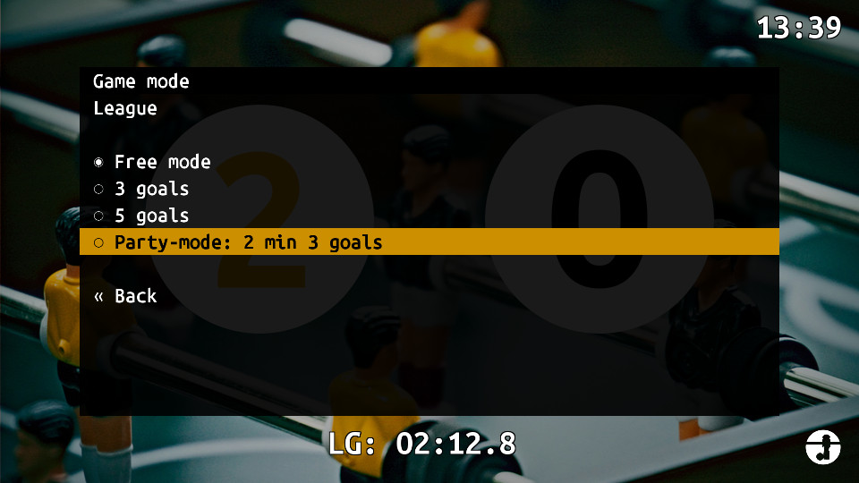
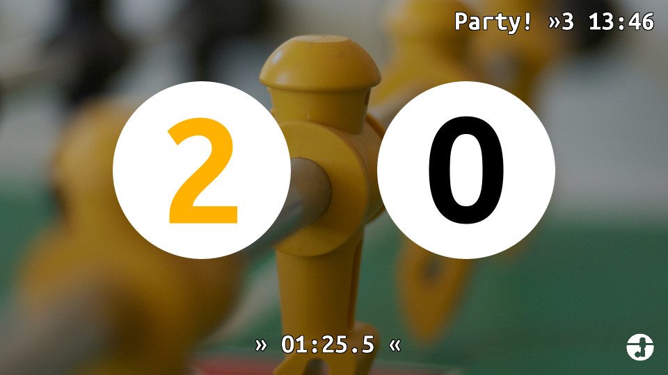
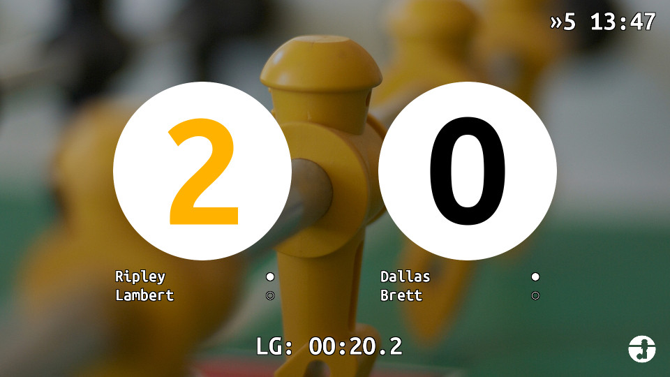

# UI

Here's a quick look at the UI and the different game modes.

## Basic game mode

In the basic game mode, the UI shows the scroe for both teams in the center, the current time in the upper right corner and the time elapsed since the last goal at the bottom.
The game can either be limited to a number of goals, which when reached displays the winning team and then resets to 0, or free, where counters simply roll over at 10.

## Menu

To change the game mode you can call up the menu (pressing the increment and decrement keys for a team at the same time, Q-Z or E-C on the keyboard)

Use the increment/decrement button to navigate and the replay button (S on the keyboard) to choose that menu item.

## Party mode

The party mode is a game with a time limit - you can configure the winning score and the timeout in the configuration.
Party mode is indicated in the top right corner, when enabled.
The time since last goal indicator in the bottom is replaced by a countdown.
If a team wins before the time runs out, the game ends immediately. If the time runs out before, the leading time is declared winner, if no team is leading the game enters a sudden death round and the next score decides the game.
This mode is especially useful when a lot of players are playing to keep matches down to a shorter time allowing for more rotation.

## League mode

The foosball game is integrated with a league system (https://github.com/netsuso/foos-tournament), it supports several leagues at the same time. Matches are assigned to groups of four people and will show up in the game menu.
Choose the game to play from the menu and you will start an official game. Each one consists of three matches with the players rotating so that all combination of pairs are played.
Team assignments are shown when a league game is started by showing the names of each player under the corresponding team's score counter.
After each match, a score counter is added to the player names showing how many matches the player has won/lost, and the player positions are changed.
As soon as the game ends, the results are sent to the league server, but before that official games can be aborted at any time from the menu.
